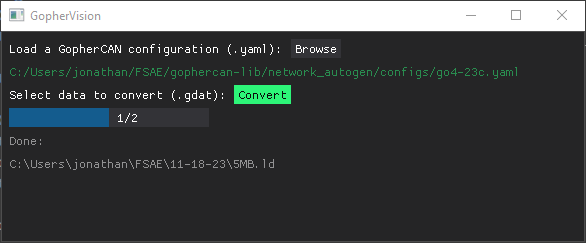

**GopherVision** is a collection of Python utilities for interacting with Gopher Motorsports data.

## Quickstart

_Just want the GUI?_ Vist the [Releases](https://github.com/gopher-motorsports/gopher-vision/releases) page to download the latest version of the desktop app. You can find `GopherVision.exe` under the "Assets" dropdown.



## Installation

1. Install [Python 3.8.10](https://www.python.org/downloads/) or newer
2. Clone the project and install dependencies:
```
git clone https://github.com/gopher-motorsports/gopher-vision.git
cd gopher-vision
pip install -r requirements.txt
```

## GUI

**Option 1:** [Download](https://github.com/gopher-motorsports/gopher-vision/releases) and run `GopherVision.exe`

**Option 2:** `python gui.py`

## CLI

Start the GopherVision console:
```console
$ python cli.py

Welcome to GopherVision. Enter ? to list commands.

(GopherVision) ?

Documented commands (type help <topic>):
========================================
convert  exit  help  info  load  plot  query


(GopherVision)
```

Get help with a command:
```console
(GopherVision) help convert
convert a .gdat file (or folder of .gdat files) to .ld

        convert [GOPHERCAN CONFIG NAME] [PATH TO .gdat]
        e.g. "convert go4-23c.yaml statefair.gdat"

        convert [GOPHERCAN CONFIG NAME] [PATH TO FOLDER]
        e.g. "convert go4-23c.yaml data/"
```

Convert a `.gdat` file to `.ld`:
```console
(GopherVision) convert go4-23c.yaml data/mock_endurance.gdat
loaded GopherCAN config: ..\gophercan-lib\network_autogen\configs\go4-23c.yaml
loading data\mock_endurance.gdat ...
...
writing to "data\mock_endurance.ld"... (0.5s)
```

Inspect the data in a `.gdat` file:
```console
(GopherVision) load go4-23c.yaml data/cooling_test.gdat
loaded GopherCAN config: ..\gophercan-lib\network_autogen\configs\go4-23c.yaml
loading data\cooling_test.gdat ...
...
created 117 channels
loaded in (26.08s)

(GopherVision) info gdat
path: data\cooling_test.gdat
t0: Tue Oct 22 14:07:06 2052
      ╷                              ╷       ╷            ╷          ╷        ╷           ╷                      ╷                     ╷              ╷              ╷       ╷        ╷         ╷
  id  │ name                         │ unit  │ type       │ n_points │ t_min  │ t_max     │ v_min                │ v_max               │ frequency_hz │ sample_count │ shift │ scalar │ divisor │ offset  
╶─────┼──────────────────────────────┼───────┼────────────┼──────────┼────────┼───────────┼──────────────────────┼─────────────────────┼──────────────┼──────────────┼───────┼────────┼─────────┼────────╴
  1   │ Engine RPM                   │ rpm   │ UNSIGNED16 │ 225396   │ 354.0  │ 1131077.0 │ 0.0                  │ 3367.0              │ 200          │ 226215       │ 4     │ 297    │ 1250    │ 0
  2   │ Engine Temp                  │ C     │ FLOATING   │ 56445    │ 356.0  │ 1131072.0 │ 9.100000381469727    │ 73.70000457763672   │ 50           │ 56553        │ 6     │ 80     │ 737     │ 0
  3   │ Eng Oil Pres                 │ kPa   │ FLOATING   │ 56434    │ 356.0  │ 1131072.0 │ 101.30000305175781   │ 581.0               │ 50           │ 56553        │ 5     │ 80     │ 581     │ 0
  4   │ Eng Oil Temp                 │ C     │ FLOATING   │ 56427    │ 356.0  │ 1131072.0 │ 8.699999809265137    │ 46.60000228881836   │ 50           │ 56553        │ 6     │ 40     │ 233     │ 0
...
```

Exit the console:
```console
(GopherVision) exit
```

Use `?` and `help` for information on available commands.

## Utilities

The `util/` folder contains some helpful standalone scripts for things like filtering .gdat files, simulating data, and basic live plotting.

### `filter.py`

This script copies packets with the specified IDs from an existing .gdat file to a new one.
```
python filter.py [INPUT].gdat [OUTPUT].gdat [IDs]
e.g. python filter.py data.gdat enginerpm.gdat 1
```

### `tx.py`

Generates random packets and sends them to a serial or network port.
```
python tx.py [PORT] [CONFIG_NAME]
e.g. python tx.py COM4 go4-24c.yaml
e.g. python tx.py /dev/tty.usbserial-X go4-24c.yaml
e.g. python tx.py 5000 go4-24c.yaml
```

### `rx.py`

Receives and parses .gdat packets from the specified serial or network port.
```
python rx.py [PORT] [CONFIG_NAME]
```

### `live-plot.py`

Receives, parses, and plots .gdat packets from the specified serial or network port.
```
python live-plot.py [PORT] [CONFIG_NAME]
```

## Contributing

Build `GopherVision.exe`:
```
pyinstaller gui.py --onefile --distpath ./ --name GopherVision
```
