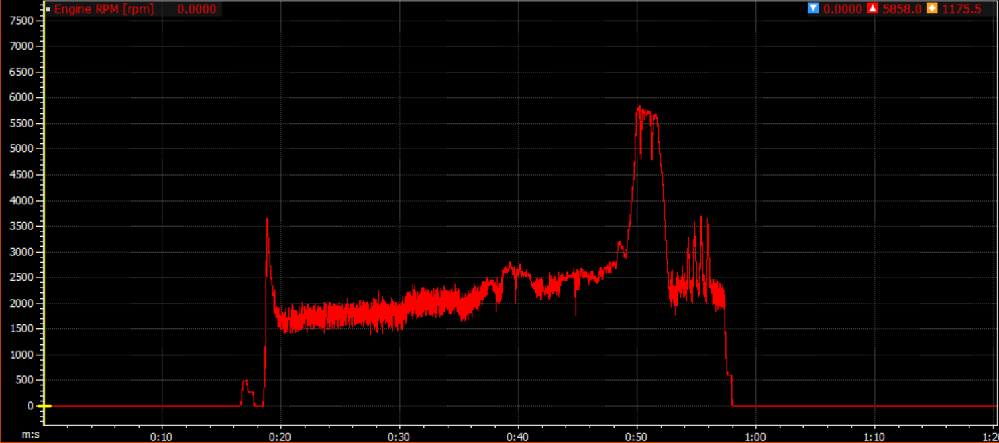
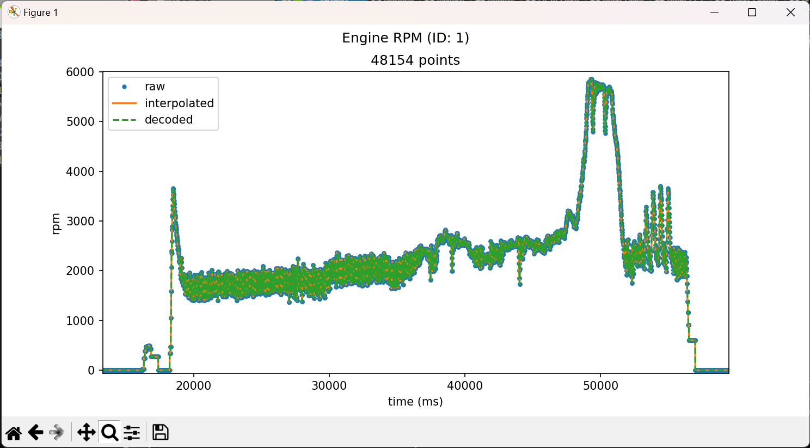
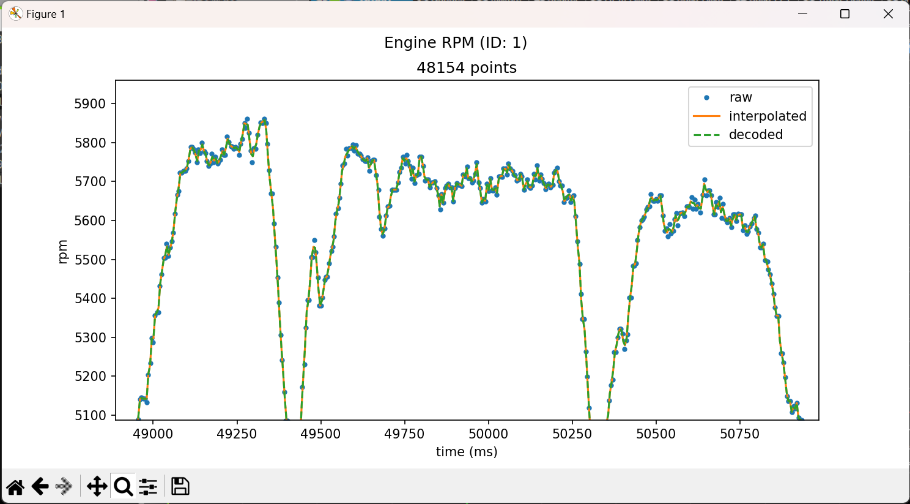

**GopherVision** is a collection of Python (3.11) utilities for interacting with Gopher Motorsports data.

## Installation
```
git clone https://github.com/gopher-motorsports/gopher-vision.git
cd gopher-vision
pipenv install
```

[Pipenv](https://pipenv.pypa.io/en/latest/) is used to manage package dependencies in a virtual environment. It must be activated before running any scripts in GopherVision. You can either:
```
pipenv shell
python go4v.py ...
pipenv exit
```
or
```
pipenv run python go4v.py ...
```
The rest of this README assumes the virtualenv is active when running a Python script.

## Usage
```
python go4v.py
```

`go4v.py` opens an interactive console with several commands available:
```
>>> help()
-------------  -----------------------------------------------------------------------------
load(path)     load a .gdat, .ld, or GopherCAN config (.yaml) into memory and parse the data
info()         print basic info on currently loaded data
info_config()  print detailed info on a loaded GopherCAN config
info_gdat()    print detailed info on a loaded .gdat file
info_ld()      print detailed info on a loaded .ld file
plot_gdat(id)  plot .gdat channel data
plot_ld(name)  plot .ld channel data
convert(path)  convert the currently loaded .gdat to a .ld at "path"
help()         print available commands
exit()         exit the console
-------------  -----------------------------------------------------------------------------
```

**WARNING:** Backslashes in path arguments must be escaped. Use `load("configs\\go4-23c.yaml")` instead of `load("configs\go4-23c.yaml")`.

### Example

A console interface enables some useful workflows like:

1. Loading a .gdat file and the associated GopherCAN config:
```
Welcome to Gopher Vision! (Python 3.11.3)
run help() to print available commands
>>> load("...\\gophercan-lib\\network_autogen\\configs\\go4-23c.yaml")
loading go4-23c.yaml ...
building parameter dictionary...
loaded 108 parameters
>>> load("9-17-IC.gdat")
loading 9-17-IC.gdat ...
read 25003214 bytes of data
parsing data...
parsed 2108461 packets, 1367 errors
interpolating data...
created 108 channels
```

2. Then converting to a .ld:
```
>>> convert("9-17-IC.ld")
encoding channels...
converting 9-17-IC.gdat to .ld ...
packing metadata...
writing to 9-17-IC.ld ...
```

3. Finding an interesting channel:

<p align="center">
  
</p>

4. And inspecting how the raw, interpolated, and encoded/decoded data series compare:

```
>>> info_gdat()
gdat path: 9-17-IC.gdat
108 channels

  id  name                          unit      shift    scalar    divisor    offset    sample_rate    points
----  ----------------------------  ------  -------  --------  ---------  --------  -------------  --------
   1  Engine RPM                    rpm           4     32767         18         0            199     48154
   ...

>>> plot_gdat(1)
```

<p align="center">
  
  
</p>

### Shortcuts

Shortcuts are provided for some common use cases to avoid using the console every time.

#### `convert`

```
python go4v.py convert go4-23c.yaml data/9-17-IC.gdat
```

Assumes the GopherCAN config exists in a sibling directory:
```
../gophercan-lib/network_autogen/configs/go4-23c.yaml
```

The .ld file will be output next to the .gdat.

You can also convert an entire folder of .gdat files:
```
python go4v.py convert go4-23c.yaml data/
```

#### `preload`

```
python go4v.py preload go4-23c.yaml data/9-17-IC.gdat
```

Assumes the GopherCAN config exists in a sibling directory:
```
../gophercan-lib/network_autogen/configs/go4-23c.yaml
```

After loading the GopherCAN config and .gdat file, the interactive console opens. From here, you can plot channels, convert to .ld, etc.